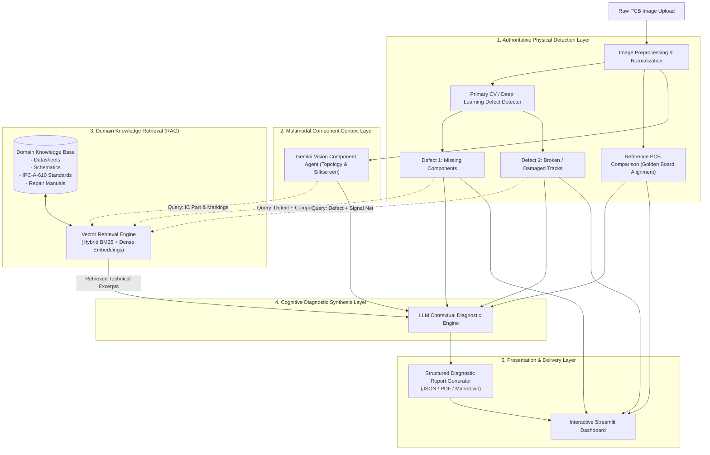

# AI-Based PCB Fault Detection & Contextual Diagnosis System
## End-to-End System Architecture & Technical Specification

---

## 1. Executive Overview & System Architecture

This project implements an end-to-end artificial intelligence and computer vision framework for **automated visual inspection (AVI)** and **contextual diagnostic reasoning** of Printed Circuit Boards (PCBs). 

The system bridges low-level computer vision defect localization with high-level cognitive diagnosis by combining:
1. **Primary Computer Vision (CV) & Deep Learning (DL) Models** for real-time defect localization.
2. **Reference PCB Comparison (Golden Template Alignment)** for structural differential analysis.
3. **Multimodal Component Understanding (Gemini Vision)** for reading markings, IC part numbers, and package topology.
4. **Domain-Specific Retrieval-Augmented Generation (RAG)** leveraging component datasheets, IPC repair standards, and PCB schematics.
5. **Large Language Model (LLM) Contextual Diagnostic Reasoning** synthesizing visual detections with technical domain literature into actionable engineering reports.
6. **An Interactive Web Dashboard** for real-time inspection, fault visualization, and repair tracking.

### 1.1 Architectural Principle: Decoupled Detection & Cognitive Reasoning
> **Core System Design Principle**:
> The primary Computer Vision / Deep Learning model is the **authoritative detector** for physical PCB defects (specifically *Missing Components* and *Broken/Damaged Copper Tracks*). 
> 
> The Large Language Model (Gemini / LLM) and RAG layers do **not** replace the primary CV detector. Instead, they act as an **expert cognitive reasoning layer** that accepts detected fault signatures, cross-references technical datasheets, analyzes circuit topography, and formulates root-cause explanations and repair procedures.



---

## 2. Image Preprocessing Pipeline

The preprocessing pipeline conditions high-resolution, unconstrained photographic inputs into standardized, noise-free representations suitable for both deep neural networks and classical template subtraction algorithms.

```
[Raw Photographic Input] 
   │
   ├── 1. Format Validation & Color Space Conversion (BGR → RGB, Grayscale, HSV)
   ├── 2. Noise Attenuation (Adaptive Bilateral Filtering & Gaussian Blur)
   ├── 3. Contrast & Illumination Normalization (CLAHE - Contrast Limited Adaptive Histogram Equalization)
   ├── 4. Geometric Rectification & Homography Registration (ORB/SIFT Keypoint Matching against Template)
   └── 5. Canonical Rescaling & ROI Cropping
```

### Preprocessing Specifications
1. **Illumination Equalization**: Real-world PCB photography frequently suffers from specular glare on solder joints and non-uniform lighting. The pipeline applies **CLAHE** on the L-channel in LAB color space to preserve copper trace edges without blowing out reflections.
2. **Noise Reduction**: **Bilateral filtering** smooths surface textures (soldermask variations) while strictly preserving high-frequency edge gradients essential for track break detection.
3. **Homography & Registration**: For reference comparison, the test board is geometrically aligned with a reference golden board using **ORB (Oriented FAST and Rotated BRIEF)** or **SIFT** keypoint estimation followed by a **RANSAC-computed Perspective Transform**.

---

## 3. Primary ML/CV Defect Detection Layer

The primary detection layer is responsible for real-time bounding box localization, pixel-level segmentation, and confidence scoring.

### Defect Target 1: Missing Components
- **Objective**: Identify component pads that should be populated with an SMD or through-hole component (resistor, capacitor, IC, diode, etc.) but are vacant, damaged, or improperly seated.
- **Methodology**:
  - **Supervised Object Detection**: Object detection models (e.g., YOLOv8 / Faster R-CNN) trained on populated vs. unpopulated component pads.
  - **Solder Pad Differential Analysis**: High-reflectivity rectangular/circular pads exposed without component bodies indicate absent parts.
  - **Silkscreen Correlation**: Verifies silkscreen boundaries (e.g., rectangular box for `R12`) where no matching component body exists within the enclosed bounding area.
- **Output Schema**:
  ```json
  {
    "defect_id": "DEF-MC-001",
    "defect_type": "missing_component",
    "bounding_box": [342, 512, 398, 580],
    "confidence": 0.96,
    "associated_reference": "C14",
    "pad_type": "0805_SMD"
  }
  ```

### Defect Target 2: Broken / Damaged Copper Tracks
- **Objective**: Detect discontinuities, scratches, pinholes, mousebites, spur defects, and trace fractures on copper signal paths and power buses.
- **Methodology**:
  - **Morphological Skeletonization**: Extracts 1-pixel wide medial axes of segmented copper traces to verify continuous graph connectivity from node to node.
  - **Edge & Contour Discontinuity Analysis**: Canny edge detection combined with contour curvature estimation flags sudden breaks in track contours.
  - **Deep Semantic Segmentation / Object Detection**: Specialized CNN/YOLO model trained on high-resolution crop windows to classify microscopic track cracks and solder shorts.
- **Output Schema**:
  ```json
  {
    "defect_id": "DEF-BT-002",
    "defect_type": "broken_copper_track",
    "bounding_box": [720, 1104, 765, 1150],
    "confidence": 0.92,
    "severity": "critical_open",
    "affected_signal_trace": "VCC_3V3_BUS"
  }
  ```

---

## 4. Multimodal Component Understanding (Gemini Vision)

The Gemini Vision Agent operates in parallel with the primary CV detection layer. It provides rich semantic understanding of the PCB's broader topology without replacing the dedicated defect detector.

```
                  ┌──────────────────────────────┐
                  │ Preprocessed PCB Image Crop  │
                  └──────────────┬───────────────┘
                                 │
                                 ▼
             ┌───────────────────────────────────────┐
             │ Gemini Vision Component Agent         │
             │ (src/agents/component_agent.py)       │
             └───────────────────┬───────────────────┘
                                 │
                 ┌───────────────┴───────────────┐
                 ▼                               ▼
       [Topological Layout]            [Component Registry]
       - Overall board summary         - IC part numbers (e.g. NE555, STM32)
       - Subsystem zones               - Resistor/Capacitor classifications
       - Silkscreen labels             - Visual package styles (DIP, QFP, 0805)
```

### Key Responsibilities:
- Deciphering faded or complex silkscreen text and component markings.
- Extracting IC package types and part numbers (e.g., `ATmega328P`, `LM317`, `ESP32`).
- Providing surrounding contextual hints (e.g., "near 5V linear regulator circuit block").

---

## 5. Reference PCB Comparison (Golden Board Differential)

When a reference ("Golden") PCB image or CAD gerber layout is available, the differential comparison module computes exact structural and photometric anomalies:

1. **Pixel-Level Absolute Difference & Structural Dissimilarity ($1 - \text{SSIM}$)**: Identifies altered, shifted, or missing solder features.
2. **Thresholded XOR Masking**: Highlights missing copper tracks and displaced components.
3. **Connected Component Filtering**: Eliminates dust/lighting artifacts, retaining only topologically significant differential clusters.

---

## 6. Domain-Specific Retrieval-Augmented Generation (RAG)

The RAG subsystem (`src/services/rag_service.py` & `knowledge_base/`) ingests technical literature and retrieves targeted domain context to substantiate LLM diagnostic hypotheses.

### 6.1 Knowledge Base Corpus (`knowledge_base/`)
- **Datasheets (`knowledge_base/datasheets/`)**: Electrical specs, pinouts, absolute maximum ratings, typical application circuits for standard components.
- **Schematics & Board Manuals (`knowledge_base/manuals/`)**: Circuit diagrams, netlists, theory of operation documents.
- **IPC Quality & Repair Standards (`knowledge_base/standards/`)**:
  - `IPC-A-610`: Acceptability of Electronic Assemblies.
  - `IPC-7711/7721`: Rework, Modification, and Repair of Electronic Assemblies (e.g., jumper wire installations, trace reconstruction).
- **Failure Mode & Effects Analysis (FMEA) (`knowledge_base/fmea/`)**: Empirical fault-symptom-cause mapping tables.

### 6.2 Retrieval Mechanism
- **Chunking Strategy**: Semantic chunking preserving circuit tables, pin diagrams, and procedure steps.
- **Hybrid Retrieval**: Combines sparse keyword matching (BM25 for exact part numbers like `MAX232` or reference designators like `R4`) with dense vector embeddings for semantic symptom search.
- **Top-$K$ Context Selection**: Injects the top 3–5 most relevant technical passages directly into the LLM diagnostic prompt.

---

## 7. LLM Contextual Diagnostic Reasoning

The diagnostic engine (`src/agents/diagnostic_agent.py`) synthesizes all upstream signals:

$$\text{Diagnostic Context} = \left\{ \text{CV Detections}, \text{Gemini Component Metadata}, \text{Golden Board Deltas}, \text{RAG Passages} \right\}$$

### 7.1 Diagnostic Reasoning Logic
```
┌─────────────────────────────────────────────────────────────────────────────┐
│                       LLM Diagnostic Prompt Synthesis                       │
├─────────────────────────────────────────────────────────────────────────────┤
│ 1. Observed Defects:                                                        │
│    - Missing capacitor C14 on VREG output pin.                             │
│    - Broken copper track on 3.3V power bus leading to MCU VDD.              │
│                                                                             │
│ 2. Board Component Context:                                                 │
│    - Regulator U2: AMS1117-3.3 (Linear Low-Dropout Regulator).               │
│    - MCU U1: ATmega328P-AU.                                                 │
│                                                                             │
│ 3. Retrieved RAG Literature:                                                │
│    - AMS1117 Datasheet: "Output capacitor (min 10uF tantalum/ceramic) is    │
│      mandatory for loop stability. Absence induces 500kHz oscillation."     │
│    - IPC-7711 Procedure 4.3: "Trace replacement via AWG 30 jumper wire."   │
│                                                                             │
│ 4. Cognitive Inference Goal:                                                │
│    - Deduce circuit failure mechanism (Unregulated voltage + MCU power loss)│
│    - Prescribe step-by-step IPC repair instructions with safety cautions.    │
└─────────────────────────────────────────────────────────────────────────────┘
```

---

## 8. Standardized Diagnostic Report Specification

Every analysis execution generates a structured, machine-parsable JSON report and a corresponding human-readable summary.

```json
{
  "report_id": "REP-20260901-PCB-0042",
  "timestamp": "2026-09-01T22:00:00Z",
  "board_metadata": {
    "image_name": "pcb_sample_042.jpg",
    "board_family": "Power Regulation & MCU Module",
    "visual_summary": "Single-sided FR4 PCB with linear regulator and micro-controller circuit."
  },
  "detected_faults": [
    {
      "fault_id": "FLT-01",
      "category": "missing_component",
      "component_type": "capacitor",
      "reference_designator": "C14",
      "location_bbox": [342, 512, 398, 580],
      "cv_confidence": 0.96
    },
    {
      "fault_id": "FLT-02",
      "category": "broken_copper_track",
      "signal_net": "3V3_POWER_RAIL",
      "location_bbox": [720, 1104, 765, 1150],
      "cv_confidence": 0.92
    }
  ],
  "contextual_diagnosis": {
    "primary_fault": "Broken 3.3V VDD trace coupled with absent regulator output smoothing capacitor C14",
    "probable_cause": "Mechanical stress / etching over-etch during PCB fabrication, accompanied by pick-and-place feeder misfeed.",
    "circuit_impact": "Microcontroller U1 receives 0V VDD causing total board inactivity. If power rail is bypassed without C14, AMS1117 will oscillate, causing voltage spikes up to 4.8V and risking catastrophic overvoltage to U1.",
    "recommended_action": [
      "1. Install 10uF 0805 SMD ceramic capacitor onto C14 pads using Sn63/Pb37 solder at 320°C.",
      "2. Bridge fractured copper track on 3.3V rail using 30 AWG insulated kynar jumper wire per IPC-7721 Section 4.2.3.",
      "3. Seal jumper wire with UV-curable solder mask to prevent vibration detachment.",
      "4. Measure resistance between 3.3V and GND before powering (verify > 10k Ohm)."
    ],
    "supporting_evidence": [
      "AMS1117 datasheet section 6.2 specifies required output capacitance for loop stability.",
      "IPC-7721 standard procedure 4.2.3 for trace restoration."
    ],
    "confidence_assessment": {
      "overall_diagnostic_confidence": 0.94,
      "cv_detection_certainty": 0.95,
      "rag_relevance_score": 0.92,
      "uncertainty_notes": "Trace net name inferred from U2 pinout; schematics confirm single-rail topology."
    }
  }
}
```

---

## 9. Interactive Dashboard Specification (`app/`)

The user-facing dashboard is built with **Streamlit** to enable intuitive visual verification and engineering collaboration:

- **Panel 1: Ingestion & Live Viewport**: Upload test image and optional golden template image.
- **Panel 2: Computer Vision Defect Overlays**: Toggle bounding boxes, confidence tags, and segmentation masks for missing components and track cuts.
- **Panel 3: Differential Heatmap**: Visual side-by-side comparison showing structural differences.
- **Panel 4: Component Inventory & Silkscreen Inspector**: Table of detected components with designators and confidence scores.
- **Panel 5: RAG Context Explorer**: Expandable citations from datasheets and IPC repair standards used in the diagnosis.
- **Panel 6: Structured Engineering Report & Export**: Full diagnostic narrative with one-click export to **JSON**, **Markdown**, and **PDF**.

---

## 10. Complete System Data Flow

```
[PCB Image File (.jpg / .png)]
              │
              ▼
    [1. src/processing/preprocessor.py] ──> Normalizes, removes noise, aligns image
              │
              ├───> [2. src/processing/cv_detector.py] ────> Produces Bounding Boxes, Types & Confidences
              │        ├── Missing Components
              │        └── Broken Copper Tracks
              │
              ├───> [3. src/processing/aligner.py] ───────> Produces Golden Image Difference Map
              │
              └───> [4. src/agents/component_agent.py] ───> Produces Component List & Silkscreen Info
                            │
                            ▼
    [5. src/services/rag_service.py] <───── Queries knowledge_base/ with (Defects + Components)
              │
              ▼ (Returns Relevant Datasheet & IPC Excerpts)
    [6. src/agents/diagnostic_agent.py] ───> LLM synthesizes All Signals into Structured Diagnosis
              │
              ▼
    [7. src/services/report_service.py] ───> Saves to results/diagnostic_reports/ & results/detected_components/
              │
              ▼
    [8. app/app.py (Streamlit Dashboard)] ─> Renders UI, Bounding Box Overlays, & PDF/JSON Export
```

---

## 11. Folder Responsibilities & Module Organization

```
AI-Based-PCB-Fault-Detection/
├── .env                              # Secure environment variables (GEMINI_API_KEY)
├── .gitignore                        # Git exclusion rules (.env, venv, pycache)
├── requirements.txt                  # Python dependencies
├── README.md                         # Project overview and quickstart
│
├── app/                              # Presentation & UI Layer
│   └── app.py                        # Streamlit interactive visual dashboard
│
├── data/                             # Dataset Storage & Asset Catalog
│   ├── raw/                          # Raw PCB inspection photographs
│   ├── processed/                    # Preprocessed and normalized image frames
│   └── test/                         # Benchmark evaluation images & test sets
│
├── docs/                             # Engineering & Research Documentation
│   ├── dataset.md                    # Dataset specification and defect definitions
│   └── system_architecture.md        # Complete research-paper system architecture
│
├── knowledge_base/                   # Domain-Specific RAG Document Store
│   ├── datasheets/                   # Electronic component datasheets (PDF / Markdown)
│   ├── manuals/                      # PCB schematics, board layout guides, netlists
│   ├── standards/                    # IPC-A-610 & IPC-7711/7721 repair standards
│   └── fmea/                         # Failure modes and effects analysis tables
│
├── models/                           # Trained ML & Deep Learning Model Weights
│   ├── missing_component_detector/   # YOLO / CNN weights for missing component pads
│   └── track_defect_detector/        # CV / Segmentation weights for broken copper tracks
│
├── notebooks/                        # Research, Prototyping & Experimentation
│   ├── 01_data_preprocessing.ipynb  # Image pipeline validation
│   ├── 02_cv_model_training.ipynb    # Model training and ablation experiments
│   └── 03_rag_diagnostic_eval.ipynb  # RAG retrieval and LLM diagnosis benchmarking
│
├── results/                          # Persistent Diagnostic & Inspection Output
│   ├── detected_components/          # Extracted component metadata and crop images
│   └── diagnostic_reports/           # Generated structured JSON & PDF inspection reports
│
├── src/                              # Core Application Logic & Pipelines
│   ├── __init__.py                   # Package initializer
│   ├── pipeline.py                   # Master end-to-end inspection & diagnosis pipeline
│   │
│   ├── agents/                       # Intelligent Reasoning & Agentic Modules
│   │   ├── __init__.py
│   │   ├── component_agent.py        # Gemini Vision component & silkscreen analyzer
│   │   ├── diagnostic_agent.py       # LLM contextual diagnostic reasoning agent
│   │   └── rag_agent.py              # Query formulation and literature synthesis agent
│   │
│   ├── processing/                   # Computer Vision & Image Transformation Modules
│   │   ├── __init__.py
│   │   ├── preprocessor.py           # CLAHE, bilateral filtering, color conversions
│   │   ├── aligner.py                # ORB/SIFT homography registration & difference mapping
│   │   └── cv_detector.py            # Primary CV/DL detector for missing parts & broken tracks
│   │
│   └── services/                     # Business Logic, Data Storage & Export Services
│       ├── __init__.py
│       ├── rag_service.py            # Vector database indexing, embedding & retrieval
│       ├── report_service.py         # JSON/PDF/Markdown report serialization & storage
│       └── export_service.py         # Data export and diagnostic metrics logger
│
└── tests/                            # Automated Unit & Integration Tests
    ├── test_gemini_connection.py     # Gemini API connectivity validation
    ├── test_preprocessing.py         # Preprocessing pipeline unit tests
    ├── test_cv_detection.py          # Primary detector regression tests
    └── test_diagnostic_pipeline.py   # End-to-end pipeline verification
```

---

## 12. Verification & Phased Implementation Roadmap

1. **Phase 1: Environment & Architecture Alignment** *(Completed)*
   - Virtual environment, Gemini SDK setup, and system architecture blueprint finalized.
2. **Phase 2: Preprocessing & Primary CV Defect Detection Pipeline**
   - Implement `src/processing/preprocessor.py` and `src/processing/cv_detector.py` for missing components and broken tracks.
3. **Phase 3: Domain RAG Knowledge Base Construction**
   - Populate `knowledge_base/` with datasheets, schematics, and IPC repair standards; build vector retrieval in `src/services/rag_service.py`.
4. **Phase 4: LLM Contextual Diagnostic Reasoning Agent**
   - Implement `src/agents/diagnostic_agent.py` and `src/services/report_service.py` to synthesize CV outputs, RAG context, and generate structured reports.
5. **Phase 5: Streamlit Interactive Dashboard & End-to-End Evaluation**
   - Integrate all modules into `app/app.py` for live image uploading, visual defect overlay, and diagnostic report download.
